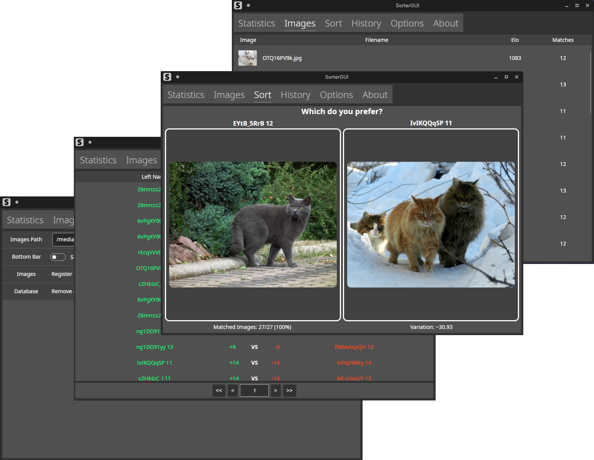

# SorterGUI

This is a cross platform GUI tool made with Avalonia used to rank images with elo by battling them against each other.

### Usage
* Specify an images path in options
  * Images grabbed from this path include subdirectories
* Click the Sync button to scan the images path see what can be added or removed when synchronizing the database
  * Viewing the registered images and their stats is possible in the Images tab
  * After at least two images are registered, the Sort tab becomes available
* Pick the image you prefer in the Sort tab, this will calculate the ratings, variation and statistics according to the result
  * Results of every battle can be seen in the History tab

### Installation
* Build the project or download latest release
